# modelo-pie-diabetico
Este repositorio contiene los códigos y resultados asociados al análisis de pacientes con pie diabético atendidos en el Hospital de Puerto Montt.

## Descripción

El proyecto integra análisis descriptivo, geoespacial, trayectorias diagnósticas y modelos probabilísticos mediante redes bayesianas, con el objetivo de estudiar la progresión clínica, la reincidencia hospitalaria y variables territoriales asociadas al pie diabético.

## Importante sobre los datos

La base de datos original no se incluye en este repositorio, debido a que contiene información clínica y administrativa sensible de pacientes.

Por esta razón, el repositorio contiene únicamente códigos, estructura del proyecto y capturas de resultados esperados.

## Contenido del repositorio

- `codigo/`: scripts utilizados para limpieza, análisis descriptivo, accesibilidad geográfica, transiciones diagnósticas y redes bayesianas.
- `imagenes_resultados/`: gráficos, mapas y capturas de los principales resultados.
- `datos/`: carpeta informativa sobre la base de datos requerida, sin incluir archivos originales.

## Análisis realizados

- Caracterización de pacientes.
- Distribución espacial.
- Clasificación urbano-rural.
- Reincidencia hospitalaria.
- Accesibilidad geográfica.
- Transiciones diagnósticas mediante códigos CIE-10.
- Modelos de redes bayesianas.

## Ejemplos de resultados

### Distribución espacial de pacientes en la Región de Los Lagos

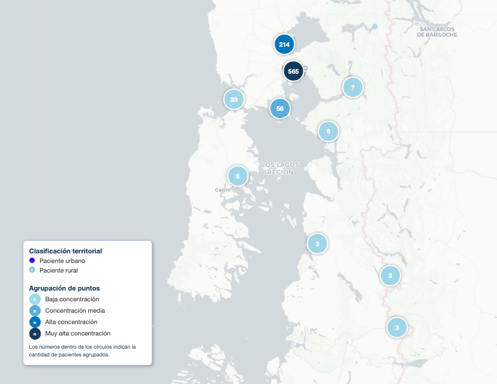

### Distribución espacial de pacientes en Puerto Montt

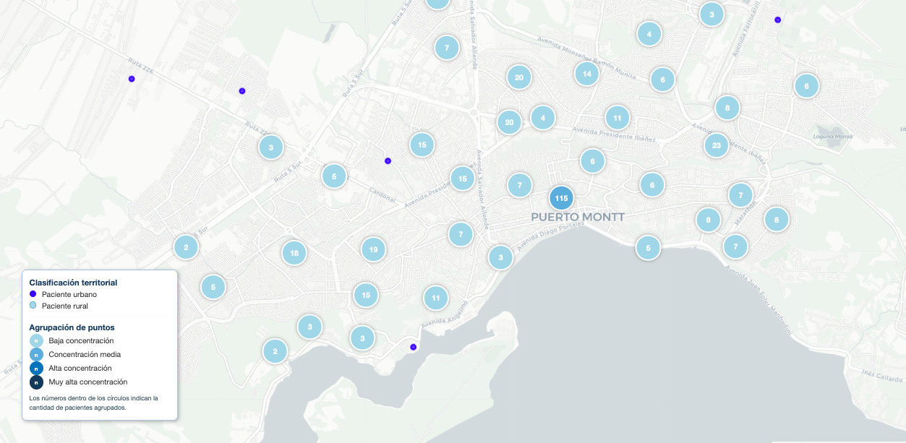

### Distribución de pacientes por comuna

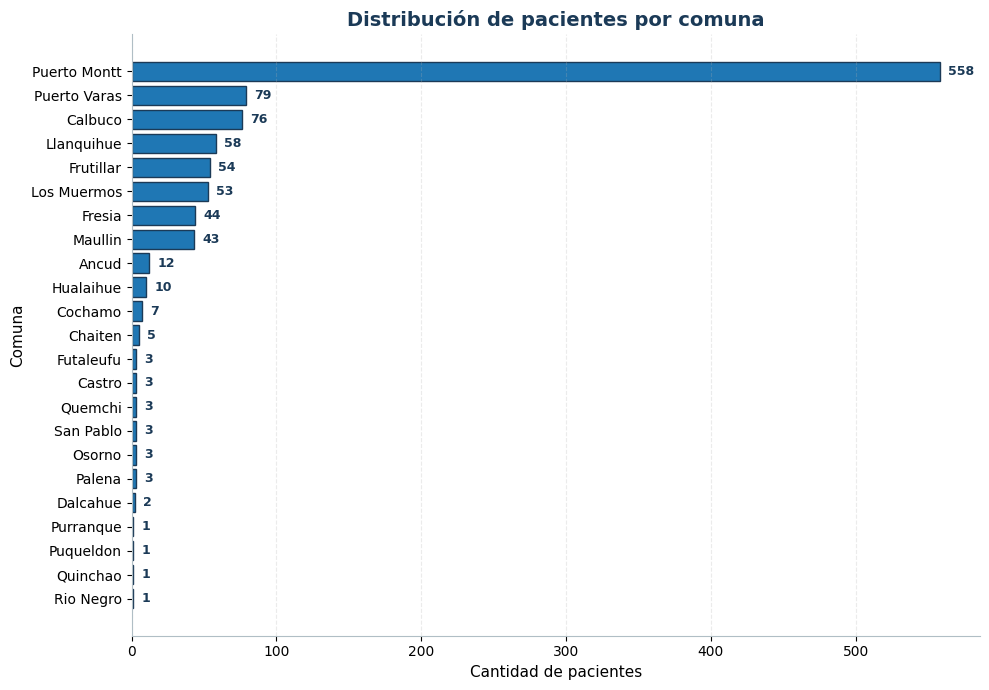

### Clasificación territorial de pacientes

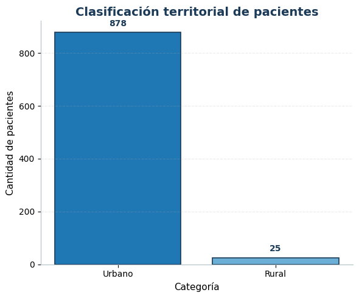

### Reincidencia hospitalaria

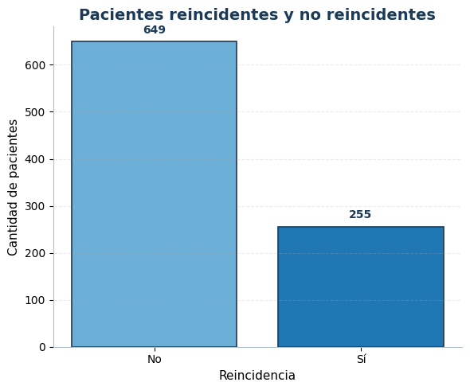

### Reincidencia hospitalaria

### Reincidencia según clasificación territorial

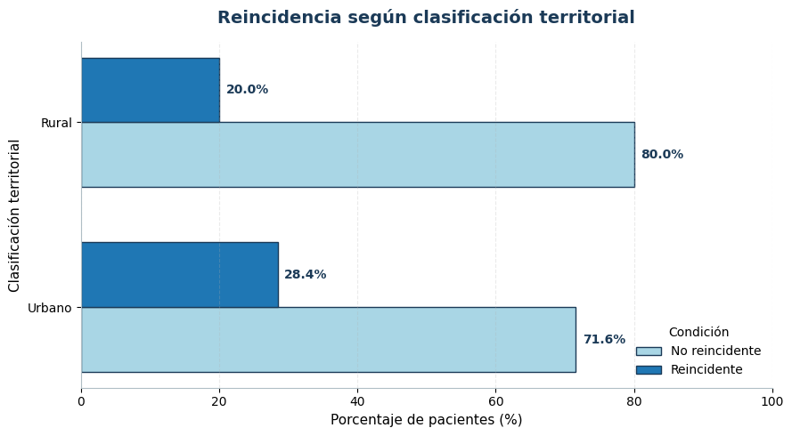

### Distribución porcentual de pacientes por sexo

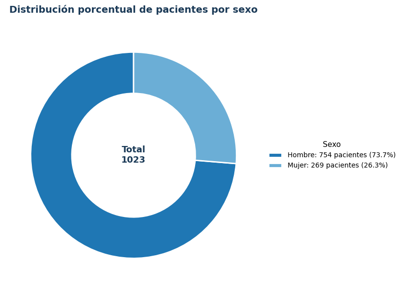

### Distribución de pacientes por sexo

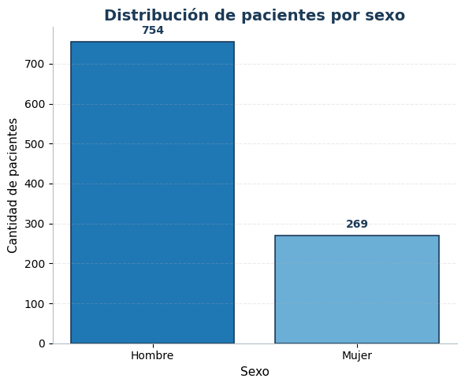

### Distribución de pacientes según tramo FONASA

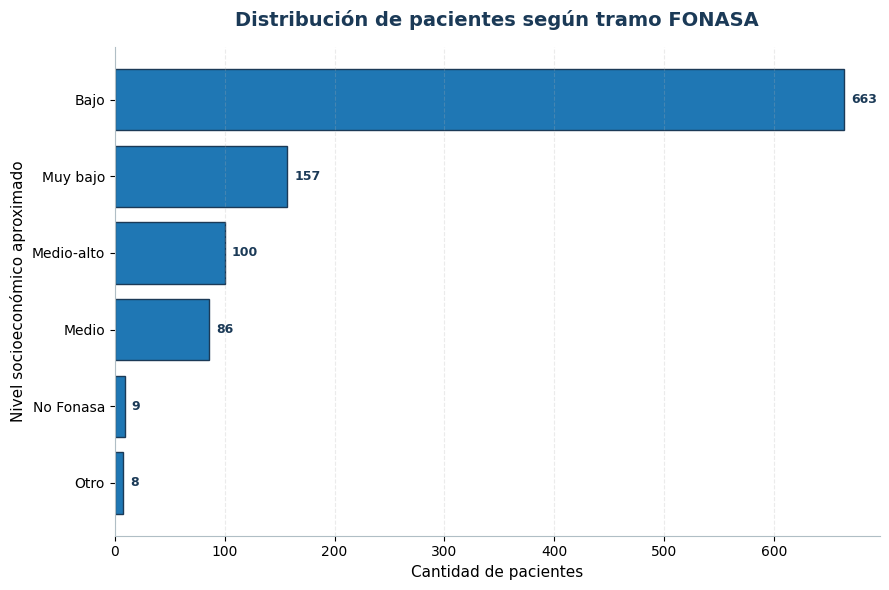

### Distribución de distancia al hospital

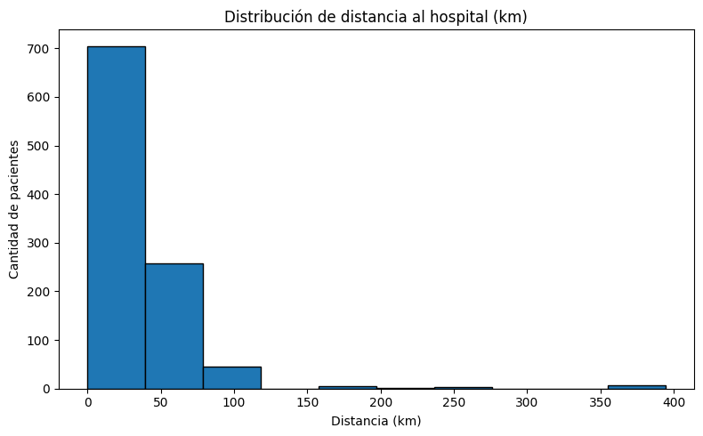

### Distribución del tiempo de traslado al hospital

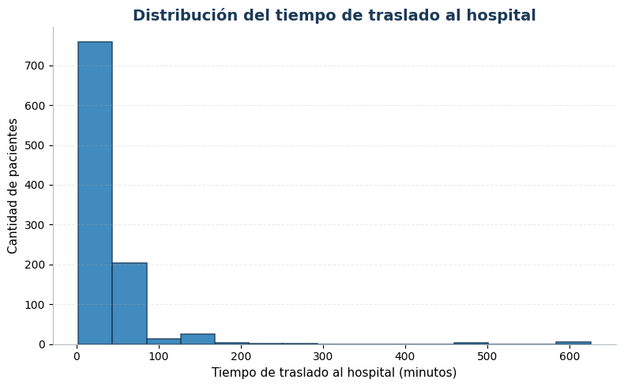

### Promedio de tiempo de traslado según zona

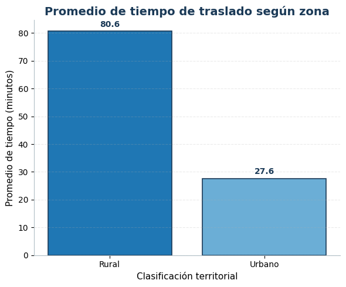

### Grafo de transiciones diagnósticas

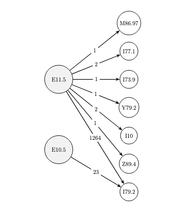

## Autora
Bárbara Pavez
Magíster en Simulación Computacional
Pontificia Universidad Católica de Valparaíso
